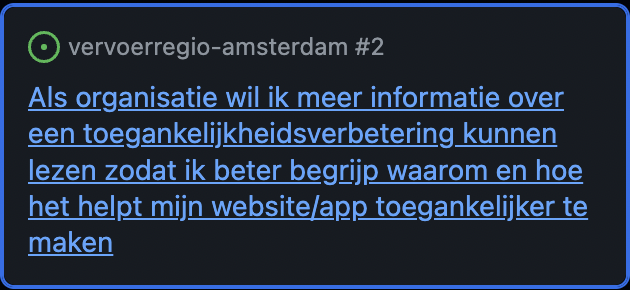
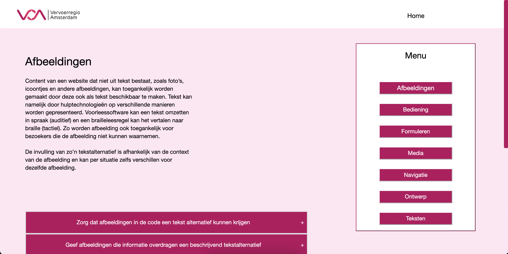
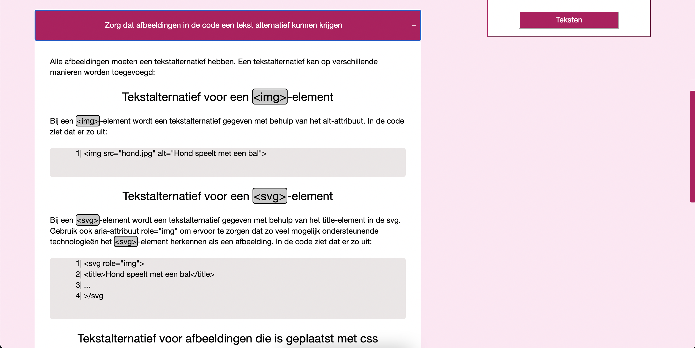

# Vervoerregio Amsterdam

<!-- Geef je project een titel en schrijf in één zin wat het is -->

## Inhoudsopgave

- [Beschrijving](#beschrijving)
- [Kenmerken](#kenmerken)
<!-- * [Bronnen](#bronnen)
- [Licentie](#licentie) -->

## Beschrijving

De Vervoerregio is een samenwerkingsverband van veertien gemeenten op het gebied van verkeer en openbaar vervoer. Om op een goede manier te overleggen en besluiten te nemen zijn er diverse (bestuurs)vormen van overleg: De regioraad, het dagelijks bestuur, portefeuillehoudersoverleggen en commissies.

Het doel is om een website te maken voor de partners van Vervoerregio Amsterdam om te laten zien wat je moet doen om de desbetreffende website toegankelijk te maken. De toegankelijkheid wordt een groot probleem als mensen met een beperking websites proberen te bezoeken maar deze niet goed toegankelijk zijn.

Backlog item:

 

Vervoerregio Amsterdam wil kunnen laten zien aan partners wat zij moeten doen om hun website toegankelijker te maken.

 

 

Op de site kan je zien wat je per onderwerp kan doen om een website toegankelijker te maken. Je kan klikken op bijvoorbeeld afbeeldingen, dan kom je op een andere site wat laat zien wat je kan doen aan dit specifieke onderwerp. Er staan een aantal kopjes over wat je kan doen om de afbeeldingen toegankelijker te maken.

 

https://dikketimo.github.io/the-client-case/

<!-- In de Beschrijving staat hoe je project er uit ziet, hoe het werkt en wat je er mee kan. -->
<!-- Voeg een mooie poster visual toe 📸 -->
<!-- Voeg een link toe naar Github Pages 🌐-->

## Kenmerken

In dit project is veel html gebruikt, daarbij css en javascript. Voor elk onderwerp is een aparte html pagina gebruikt.

<!-- Bij Kenmerken staat welke technieken zijn gebruikt en hoe. Wat is de HTML structuur? Wat zijn de belangrijkste dingen in CSS? Wat is er met Javascript gedaan en hoe? Misschien heb je een framwork of library gebruikt? -->

## Bronnen

  <ul>
    <li>https://www.vervoerregio.nl/</li>
    <li>https://wcag.nl/kennisbank/</li>
    <li>https://developer.mozilla.org/en-US/docs/Web/CSS/overflow-x</li>
  </ul>
